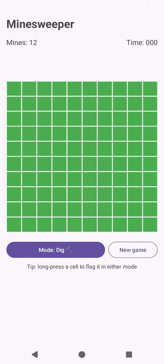
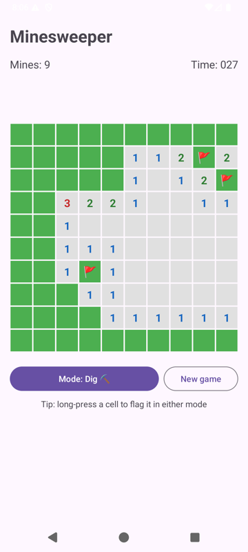
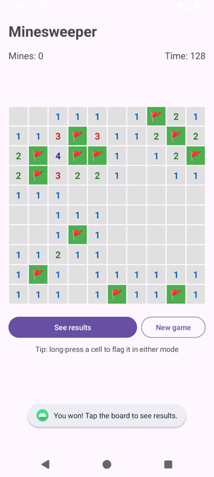
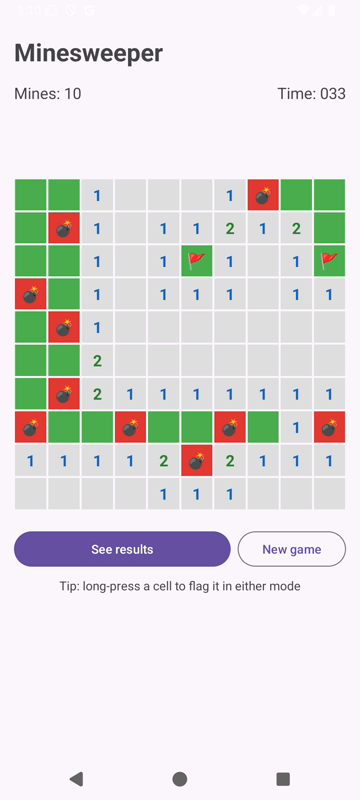
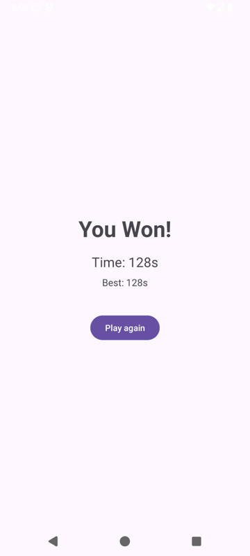

# Minesweeper for Android

[](https://github.com/spark318/MinesGame/actions/workflows/android.yml)

A native Android Minesweeper game written in Java. The game rules are fully separated from the UI and covered by unit tests.

<p align="center">
  
</p>

## Try it

**On an Android phone:** download [`MinesGame.apk`](https://github.com/spark318/MinesGame/releases/latest/download/MinesGame.apk) from the [latest release](https://github.com/spark318/MinesGame/releases/latest), open it, and allow installing from your browser when prompted. Requires Android 7.0+.

**From source:**

```bash
git clone https://github.com/spark318/MinesGame.git
cd MinesGame
./gradlew installDebug        # installs on a connected device or running emulator
./gradlew testDebugUnitTest   # runs the game logic tests
```

Or open the folder in Android Studio and press Run.

## Screenshots

| Mid-game | Win | Loss | Results |
|:---:|:---:|:---:|:---:|
|  |  |  |  |

## How to play

Clear every cell that isn't a mine. A number shows how many of the 8 surrounding cells hold mines.

- **Tap** a cell to dig it (or flag it, when the mode button is set to Flag).
- **Long-press** a cell to flag it in either mode.
- Your first tap is always safe.

## Technical highlights

**Game logic is separate from the UI.** [`MinesweeperGame`](app/src/main/java/io/github/spark318/minesgame/MinesweeperGame.java) is plain Java with no Android imports. It owns all the rules (mine placement, flood fill, flags, win/loss). [`GameActivity`](app/src/main/java/io/github/spark318/minesgame/GameActivity.java) only renders state and forwards taps. This is what makes the rules testable on the JVM in milliseconds, with no emulator. `Cell`'s setters are package-private, so the UI can read the board but never modify it.

**Safe first move.** Mines aren't placed until the first tap, and the 3×3 area around it is kept clear, so every game opens with a region to work from rather than a blind guess. On boards too dense for that, it falls back to protecting only the tapped cell.

**Uniform mine placement without retries.** Instead of picking random cells and retrying on collisions (which slows down as the board fills), candidate cells are shuffled with Fisher–Yates and the first *n* are taken.

**Iterative flood fill.** Revealing an empty cell opens its neighbors using a BFS queue instead of recursion, so board size can't cause a `StackOverflowError`. A test reveals a 500×500 board to prove it.

**Survives Android lifecycle events.** The game state is `Serializable` and saved in `onSaveInstanceState`, so rotating the phone or switching to dark mode doesn't reset the game. The timer uses `SystemClock.elapsedRealtime()` and pauses while the app is in the background.

**Best time.** The fastest win is stored in `SharedPreferences` and shown on the results screen.

## Project structure

```
app/src/main/java/io/github/spark318/minesgame/
├── MinesweeperGame.java     # Game rules: placement, reveal/flood fill, flags, win/loss
├── Cell.java                # Single-cell state
├── GameActivity.java        # Board UI, input handling, timer, state restore
└── GameResultActivity.java  # Result screen and best-time tracking

app/src/test/java/io/github/spark318/minesgame/
└── MinesweeperGameTest.java # 18 JVM unit tests for the game rules
```

## Testing and CI

`MinesweeperGameTest` covers mine placement (exact count, safe-first-move guarantee across many random seeds), adjacent-mine counting, flood fill boundaries, flags blocking reveals, win and loss detection, and input validation. Tests use a seeded `Random` or fixed mine layouts so they're deterministic.

GitHub Actions runs the tests, Android Lint, and an APK build on every push. Pushing a `v*` tag publishes the APK to GitHub Releases.

## Tech stack

Java 11 · Android SDK (min 24, target 36) · AndroidX AppCompat · Material 3 · ConstraintLayout · JUnit 4 · Gradle (Kotlin DSL) · GitHub Actions

## Background

This started as a course project for CS 310. After the course, I refactored it to separate the game logic from the UI, added the unit tests and CI, fixed lifecycle bugs (the game used to reset on rotation and the timer kept running after the screen closed), and added first-move safety, long-press flagging, and best-time tracking.
